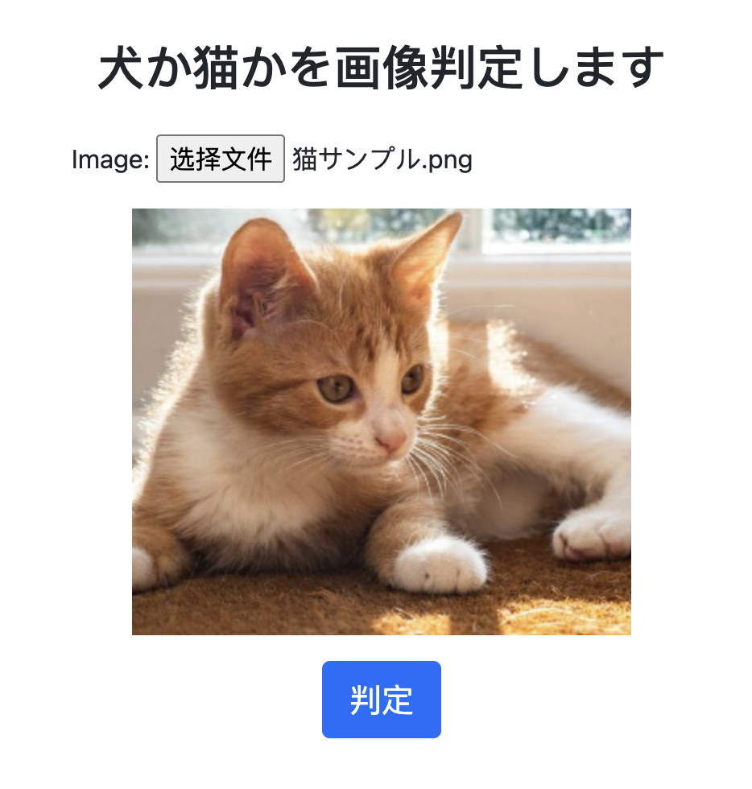
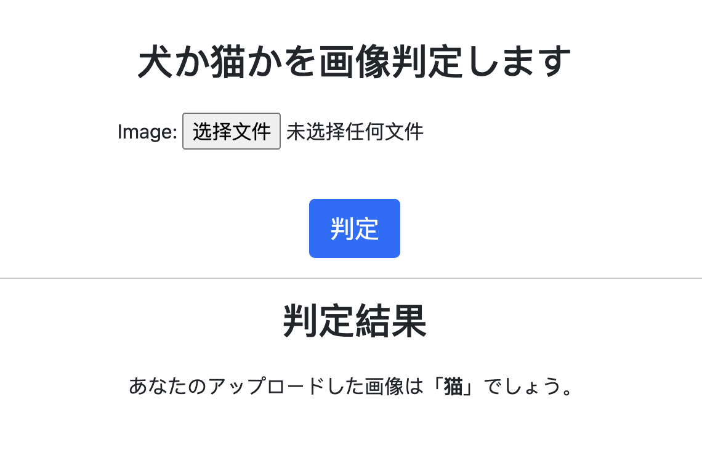

# Cat vs Dog Classifier

学習済みモデルVGG16を用いた転移学習により、犬と猫を識別する画像分類AIを構築しました。  
画像をアップロードすると、AIが犬または猫を判定します。  
また、Heroku上へデプロイし、Webアプリとして公開しています。

デモURL：  
https://catordog-61aac30d1ca3.herokuapp.com/

※ Heroku Ecoプランを利用しているため、初回アクセス時は起動まで少し時間がかかる場合があります。

---

## 使用技術

- Python
- TensorFlow
- Keras
- VGG16
- Django
- Pillow
- Heroku

---

## 主な機能

- 画像アップロード
- 犬・猫画像の分類
- AIによる予測結果表示
- Webアプリとしてデプロイ

---

## アプリ画面

### 画像アップロード画面



### 判定結果画面



---

## ディレクトリ構成

```text
catordog/
│
├── catordog/
│   ├── __init__.py
│   ├── asgi.py
│   ├── settings.py
│   ├── urls.py
│   └── wsgi.py
│
├── prediction/
│   ├── migrations/
│   ├── models/
│   ├── templates/
│   ├── __init__.py
│   ├── admin.py
│   ├── apps.py
│   ├── forms.py
│   ├── models.py
│   ├── tests.py
│   └── views.py
│
├── images/
├── .gitignore
├── manage.py
├── Procfile
├── README.md
└── requirements.txt
```

---

## 実行方法

### リポジトリをクローン

```bash
git clone https://github.com/yourname/cat-vs-dog-classifier.git
```

### 必要ライブラリをインストール

```bash
pip install -r requirements.txt
```

### サーバー起動

```bash
python manage.py runserver
```

---

## モデル

学習済みモデルVGG16を利用し、転移学習によって犬猫画像分類モデルを作成しました。

※ モデルファイル（.h5）はGitHubの容量制限のため除外しています。

---

## 今後の改善点

- 分類精度向上
- データセット拡張
- UI改善
